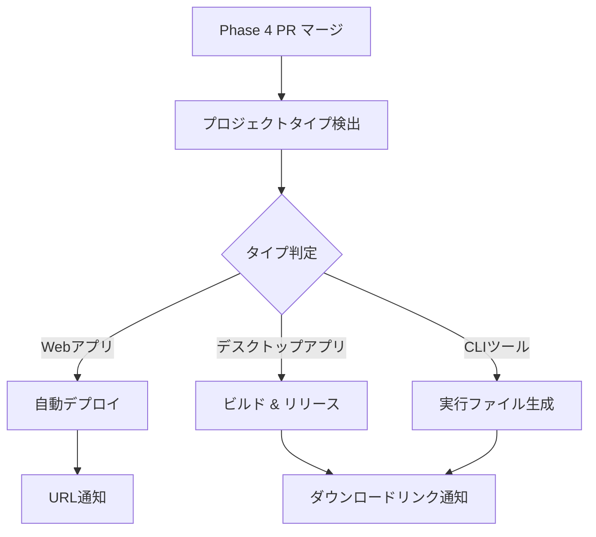

# 自動ビルド・デプロイシステム仕様書

## 概要

開発請負AIシステムにおいて、Phase 4完了時に自動的にプロジェクトをビルド・デプロイし、エンドユーザーが即座に利用できる形で提供するシステムの仕様書です。

## システムアーキテクチャ

### 基本フロー



## プロジェクトタイプ検出ロジック

### 検出基準

| ファイル/内容 | 判定されるタイプ | 説明 |
|--------------|-----------------|------|
| `package.json` + `"electron"` | `electron-app` | Electronデスクトップアプリ |
| `package.json` + `"next"` | `nextjs-web` | Next.js Webアプリ |
| `package.json` + `"react"` + `public/index.html` | `react-spa` | React SPA |
| `package.json` + `"bin"` | `node-cli` | Node.js CLIツール |
| `requirements.txt` + `flask/django/fastapi` | `python-web` | Python Webアプリ |
| `requirements.txt` | `python-app` | Pythonアプリ |
| `go.mod` | `go-app` | Goアプリケーション |

### 検出スクリプト

```bash
# プロジェクトディレクトリを特定
PROJECT_DIR=$(find . -name "package.json" -o -name "requirements.txt" -o -name "go.mod" | head -1 | xargs dirname)
cd $PROJECT_DIR

# タイプ検出ロジック（詳細は実装参照）
```

## タイプ別処理

### 1. Webアプリケーション

#### Next.js / React
- **デプロイ先**: Vercel
- **処理内容**:
  ```bash
  npm run build
  npx vercel --prod
  ```
- **出力**: 公開URL

#### Python Web
- **デプロイ先**: Render.com / Railway
- **処理内容**:
  - Dockerイメージ作成
  - プラットフォームAPIでデプロイ
- **出力**: 公開URL

### 2. デスクトップアプリケーション

#### Electron
- **ビルドツール**: electron-builder
- **出力ファイル**:
  - Windows: `.exe` インストーラー
  - macOS: `.dmg` ディスクイメージ
  - Linux: `.AppImage`

#### Python デスクトップ
- **ビルドツール**: PyInstaller
- **出力ファイル**: 各OS用実行ファイル

### 3. CLIツール

#### Node.js CLI
- **ビルドツール**: pkg
- **出力ファイル**:
  - `tool-win.exe`
  - `tool-macos`
  - `tool-linux`

#### Go CLI
- **ビルド方法**: クロスコンパイル
- **出力ファイル**: 各OS用バイナリ

## GitHub Actions ワークフロー

### ファイル: `.github/workflows/auto-build-deploy.yml`

```yaml
name: Auto Build and Deploy

on:
  pull_request:
    types: [closed]

jobs:
  build-deploy:
    if: |
      github.event.pull_request.merged == true &&
      contains(github.event.pull_request.body, 'Final Status:') &&
      contains(github.event.pull_request.body, 'PROJECT COMPLETED')
    
    runs-on: ${{ matrix.os }}
    strategy:
      matrix:
        os: [ubuntu-latest, windows-latest, macos-latest]
```

## 出力と通知

### Slack通知フォーマット

#### Webアプリの場合
```
✅ [プロジェクト名] が完成しました！

🌐 アプリケーションURL:
https://project-name.vercel.app

📚 ドキュメント: [GitHub](link)
```

#### デスクトップ/CLIアプリの場合
```
✅ [プロジェクト名] が完成しました！

📥 ダウンロード:
- Windows版: [ダウンロード](link) (XX MB)
- Mac版: [ダウンロード](link) (XX MB)
- Linux版: [ダウンロード](link) (XX MB)

📚 使い方: [ドキュメント](link)
```

### GitHub Releases

自動的に以下の内容でリリースを作成：
- タグ: `{project-name}-v1.0.0`
- タイトル: `{プロジェクト名} v1.0.0`
- アセット: ビルドされたファイル
- 説明: 自動生成されたリリースノート

## プロジェクトメタデータ

各プロジェクトに自動生成される `PROJECT_META.yml`:

```yaml
project:
  name: PDF Compressor
  type: electron-app
  version: 1.0.0
  
build:
  detected_features:
    - electron
    - typescript
    - sqlite
  build_command: npm run electron:build
  
deployment:
  method: github-release
  artifacts:
    windows:
      file: pdf-compressor-setup.exe
      size: 45.2MB
    mac:
      file: pdf-compressor.dmg
      size: 52.1MB
    linux:
      file: pdf-compressor.AppImage
      size: 48.3MB
  
  # Webアプリの場合
  # method: vercel
  # url: https://pdf-compressor.vercel.app
  # deployment_id: dpl_xxxx
```

## セキュリティ考慮事項

1. **シークレット管理**
   - `VERCEL_TOKEN`
   - `RENDER_TOKEN`
   - `GITHUB_TOKEN`
   すべてGitHub Secretsで管理

2. **ビルド環境の隔離**
   - 各ビルドは独立した環境で実行
   - 不正なコードの実行を防ぐ

3. **アーティファクトのスキャン**
   - ウイルススキャン
   - 依存関係の脆弱性チェック

## 実装スケジュール

1. **Phase 1**: 基本的な検出ロジック（1週間）
2. **Phase 2**: Node.js系のビルド対応（1週間）
3. **Phase 3**: その他言語対応（2週間）
4. **Phase 4**: 自動デプロイ統合（2週間）

## 今後の拡張

- モバイルアプリ対応（React Native, Flutter）
- コンテナ化されたアプリケーション
- マイクロサービス構成への対応
- A/Bテストデプロイメント